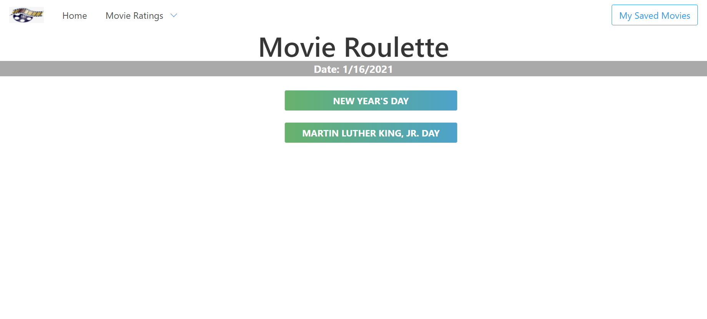

# movie_roullette
Holiday Movie Roulette

Project team members:

Binaya Luitel
Vanessa Patterson
Ethan Smith 

For this project, we have created an online app using multiple APIs that finds upcoming holidays, and then displays movies related to that holiday when clicked on. We wanted the user to have an easily accessible app that cuts down on time searching for holiday movies, so they can spend more time watching holiday classics.

To do this, we first used the api from "holidayapi.com" to pull upcoming holidays based on the month that the user is acceseing the website in. The holidays that are retruned are then appened to our webpage a buttons. If the user wants to search for movies related to a holiday on the page, they simply click the button associated with the holiday, and a group of movies appears on the page. 

We used The Movie Database "themoviedb.org" api to pull our movie information for each holiday. When the holiday movie is clicked, a search is performed through the Movie DB and returns results for that holiday. Each result is added to the page in its own box with the title, poster, and date of release. A similar process is used on the saved movie page, but the user is able to search any movie through an input box, and the search is done through the OMDb api. The movie is then saved to local storage so it can be pulled back up at a later date.

Our site is deployed at:
https://vpatt1031.github.io/movie_roullette/

and the repository for the site is at:
https://github.com/vpatt1031/movie_roullette.git

I am also including a screenshot of the deployed site:

